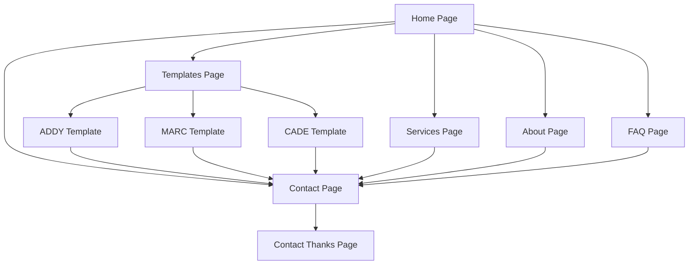

# Site Forger — Product Requirements Document

## 1. Product Overview

Site Forger is a clean, modern marketing website that sells website packages specifically to blue-collar businesses. The platform showcases three distinct demo templates (ADDY, MARC, CADE) as living examples and drives qualified leads through a high-trust, low-friction contact funnel.

The product targets trades and local service businesses including Construction, HVAC, Plumbing, Electrical, Landscaping, Trucking, Cleaning, Roofing, and Remodeling companies who need professional websites that work as hard as they do.

Site Forger aims to achieve fast load times (<1.5s), high accessibility standards (WCAG AA+), and strong conversion rates with the primary KPI being contact form submissions per visitor.

## 2. Core Features

### 2.1 User Roles

| Role | Registration Method | Core Permissions |
|------|---------------------|------------------|
| Visitor | No registration required | Can browse all pages, view templates, submit contact forms |
| Business Owner | Contact form submission | Receives quotes and project proposals via email |

### 2.2 Feature Module

Our Site Forger platform consists of the following main pages:

1. **Home page**: Hero section with value proposition, service snapshot cards, template previews, trust badges, and conversion CTAs
2. **Services page**: Detailed service offerings (Websites, SEO, Google Business) with conversion panels
3. **Templates page**: Template gallery showcasing ADDY, MARC, and CADE designs with preview cards
4. **Template detail pages**: Individual pages for each template (ADDY, MARC, CADE) with unique UI motifs and demo content
5. **About page**: Company story, principles, and team information with conversion elements
6. **FAQ page**: Accordion-style frequently asked questions with contact CTAs
7. **Contact page**: Lead capture form with validation, direct contact information, and optional map integration
8. **Contact thanks page**: Confirmation page after successful form submission

### 2.3 Page Details

| Page Name | Module Name | Feature description |
|-----------|-------------|---------------------|
| Home page | Hero Section | Display main value proposition "Websites that work as hard as you do" with primary CTA to contact and secondary CTA to templates |
| Home page | Trust Badges | Show Mobile-Friendly, SEO-Optimized, Fast Turnaround credentials |
| Home page | Service Snapshot | Display 3 service cards (Websites, SEO, Google Business) with deep links |
| Home page | Value Props | Present 3 key benefits: Quick Turnaround, Built to Scale, Made for Trades |
| Home page | Template Preview | Show inline cards for ADDY, MARC, CADE with taglines and CTAs |
| Home page | CTA Banner | Final conversion element "Ready to win more local jobs?" |
| Services page | Service Details | Three detailed sections with anchors for websites, SEO, and Google Business |
| Services page | Conversion Panel | End-of-page CTA "Need a website that pays for itself?" |
| Templates page | Template Grid | Display 3 template cards with names, tones, thumbnails, and detail links |
| Template Detail | ADDY Motif | Airy, minimal design with split hero, quick-contact chips, stacked cards, gallery slider |
| Template Detail | MARC Motif | Bold, full-width design with oversized typography, image bands, stat blocks, masonry gallery |
| Template Detail | CADE Motif | Conversion-focused with checklist hero, process timeline, sticky mobile CTA |
| About page | Company Story | Origin story, principles, team information with conversion CTA |
| FAQ page | Question Accordion | Expandable Q&A list with contact CTA at bottom |
| Contact page | Lead Form | Name, email, phone, business, message fields with honeypot protection and server validation |
| Contact page | Direct Contact | Phone, email, address information display |
| Contact page | Map Integration | Optional MapLibre embed showing business location |
| Contact Thanks | Confirmation | Success message and next steps after form submission |

## 3. Core Process

**Visitor Flow:**
1. Visitor lands on Home page and sees value proposition
2. Visitor explores Services to understand offerings
3. Visitor views Templates to see design options
4. Visitor checks About page for company credibility
5. Visitor reviews FAQ for common questions
6. Visitor submits Contact form for quote
7. Visitor receives confirmation on Thanks page

**Template Exploration Flow:**
1. Visitor clicks "View Templates" from Home
2. Visitor browses template grid on Templates page
3. Visitor clicks specific template (ADDY, MARC, or CADE)
4. Visitor experiences template's unique motif and content
5. Visitor clicks "Use this template" CTA to Contact form with pre-selected template

## 4. User Interface Design

### 4.1 Design Style

**Color Palette:**
- Primary: #2563EB (blue)
- Primary Hover: #1E40AF (darker blue)
- Accent: #10B981 (green)
- Background: #F7F9FC (light gray-blue)
- Surface: #FFFFFF (white)
- Text: #0F172A (dark slate)
- Muted Text: #475569 (gray)
- Border: #E5E7EB (light gray)
- Focus Ring: #93C5FD (light blue)

**Typography:**
- Font Family: Inter (or system fallback)
- Headings: 700/800 weight with tight letter-spacing
- Body: 400/500 weight with normal spacing
- Scale: H1 44-56px, H2 30-36px, H3 22-24px, Body 16-18px, Caption 13-14px
- Line Height: 1.35-1.6 for optimal readability

**Component Style:**
- Buttons: rounded-xl (16-20px), medium weight, clear hover states, visible focus rings
- Cards: rounded-2xl, 24px padding, soft shadows (elevation 8-16)
- Navigation: sticky, translucent on scroll with backdrop-blur effect

**Animation:**
- Framer Motion with 200-300ms duration
- Spring animations (20-30 tension)
- Tasteful micro-interactions for engagement

### 4.2 Page Design Overview

| Page Name | Module Name | UI Elements |
|-----------|-------------|-------------|
| Home page | Hero Section | Large typography with eyebrow text, dual CTA buttons (primary/secondary), trust badge row |
| Home page | Service Cards | 3-column grid on desktop, stacked on mobile, card shadows, hover effects |
| Templates page | Template Grid | Responsive grid layout, thumbnail previews, overlay CTAs, consistent card styling |
| ADDY Template | Card Stack | Light elevation shadows, rounded corners, ample whitespace, soft dividers |
| MARC Template | Full-bleed Design | Oversized typography, parallax image bands, bold stat blocks, masonry gallery |
| CADE Template | Conversion Focus | Checklist with checkmarks, numbered timeline, sticky bottom CTA on mobile |
| Contact page | Form Layout | Two-column desktop (form + contact info), single column mobile, map integration |

### 4.3 Responsiveness

The design follows a balanced responsive approach (not mobile-first) with intentional parity across devices:

- **Breakpoints**: sm (640px), md (768px), lg (1024px), xl (1280px), 2xl (1536px)
- **Desktop**: 12-column grid with 24px gutters, full navigation menu
- **Mobile**: Stacked layout with drawer navigation, optimized touch targets (≥44px)
- **Typography**: Fluid scaling using clamp() to maintain hierarchy across all screen sizes
- **Navigation**: Sticky translucent header on desktop, mobile sheet/drawer for menu
- **Special Features**: Sticky bottom CTA on CADE template for mobile conversion optimization