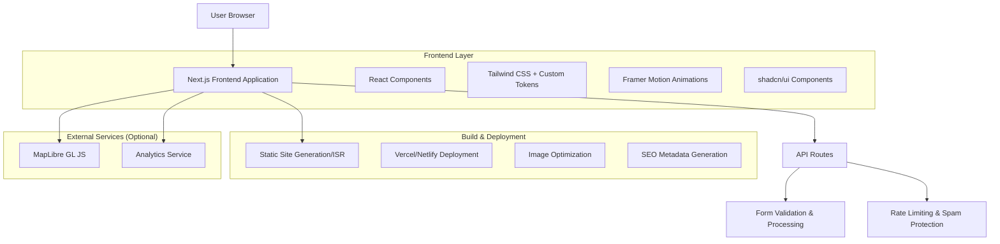
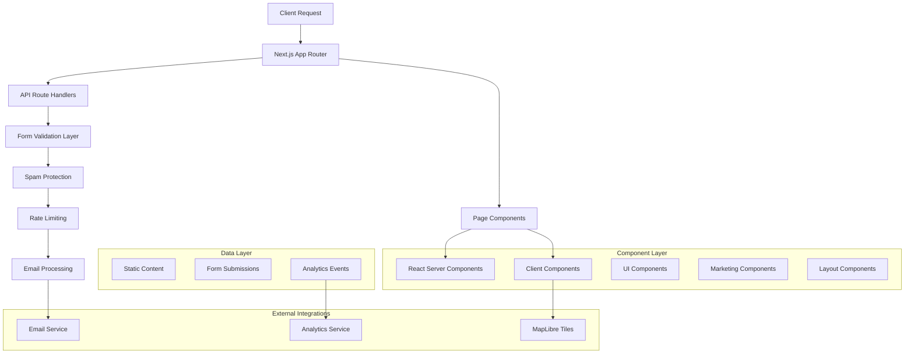
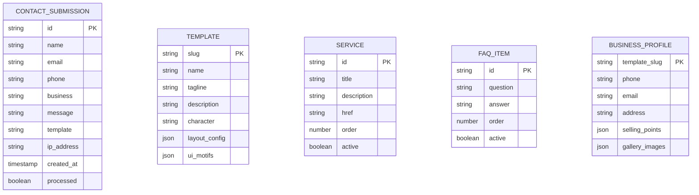

# Site Forger — Technical Architecture Document

## 1. Architecture Design



## 2. Technology Description

- **Frontend**: Next.js 14+ (App Router) + React 18 + TypeScript
- **Styling**: Tailwind CSS 3+ with custom design tokens + CSS variables
- **UI Components**: shadcn/ui + Lucide React icons
- **Animation**: Framer Motion with performance budget (200-300ms)
- **Form Handling**: React Hook Form + Zod validation
- **Image Optimization**: Next.js Image component with responsive sizing
- **SEO**: Next.js Metadata API with structured data
- **Maps**: MapLibre GL JS (open source, no API keys required)
- **Analytics**: Plausible or similar privacy-focused solution
- **Deployment**: Vercel (recommended) or Netlify

## 3. Route Definitions

| Route | Purpose |
|-------|---------|
| / | Home page with hero, services preview, templates showcase, and conversion CTAs |
| /services | Detailed service offerings (Websites, SEO, Google Business) with conversion panels |
| /templates | Template gallery showcasing ADDY, MARC, and CADE designs |
| /templates/addy | ADDY template demo with airy, minimal design motif |
| /templates/marc | MARC template demo with bold, full-width imagery-driven design |
| /templates/cade | CADE template demo with conversion-focused, direct approach |
| /addy | Vanity URL redirect to /templates/addy |
| /marc | Vanity URL redirect to /templates/marc |
| /cade | Vanity URL redirect to /templates/cade |
| /about | Company story, principles, and team information |
| /about/short | Condensed about page for link previews |
| /faq | Frequently asked questions with accordion interface |
| /contact | Lead capture form with validation and contact information |
| /contact/thanks | Confirmation page after successful form submission |
| /privacy | Privacy policy and data handling information |
| /sitemap | XML sitemap for SEO |

## 4. API Definitions

### 4.1 Core API

Contact form submission
```
POST /api/contact
```

Request:
| Param Name | Param Type | isRequired | Description |
|------------|------------|------------|-------------|
| name | string | true | Full name of the contact |
| email | string | true | Valid email address |
| phone | string | true | Phone number for contact |
| business | string | true | Business name or type |
| message | string | true | Detailed message or requirements |
| template | string | false | Pre-selected template (ADDY, MARC, CADE) |
| company_website | string | false | Honeypot field (should be empty) |

Response:
| Param Name | Param Type | Description |
|------------|------------|-------------|
| success | boolean | Indicates if submission was successful |
| message | string | Success or error message |
| redirectUrl | string | URL to redirect to on success |

Example Request:
```json
{
  "name": "John Smith",
  "email": "john@smithconstruction.com",
  "phone": "(555) 123-4567",
  "business": "Smith Construction LLC",
  "message": "Looking for a professional website to showcase our residential construction services.",
  "template": "MARC",
  "company_website": ""
}
```

Example Response:
```json
{
  "success": true,
  "message": "Thank you for your inquiry! We'll be in touch within 24 hours.",
  "redirectUrl": "/contact/thanks"
}
```

Rate limiting endpoint
```
GET /api/rate-limit
```

Response:
| Param Name | Param Type | Description |
|------------|------------|-------------|
| remaining | number | Remaining requests for current IP |
| resetTime | number | Unix timestamp when limit resets |

## 5. Server Architecture Diagram



## 6. Data Model

### 6.1 Data Model Definition



### 6.2 Data Definition Language

Since this is a static marketing site with form submissions, most data will be stored as JSON content files rather than a traditional database. However, here are the TypeScript interfaces that define our data structures:

**Content Types (lib/types.ts)**
```typescript
// Template configuration
interface Template {
  slug: 'addy' | 'marc' | 'cade';
  name: string;
  tagline: string;
  description: string;
  character: string;
  href: string;
  motifs: {
    layout: string[];
    typography: string[];
    components: string[];
  };
}

// Service offerings
interface Service {
  id: string;
  title: string;
  description: string;
  href: string;
  icon: string;
  features: string[];
}

// FAQ items
interface FAQItem {
  id: string;
  question: string;
  answer: string;
  category?: string;
}

// Contact form data
interface ContactFormData {
  name: string;
  email: string;
  phone: string;
  business: string;
  message: string;
  template?: 'ADDY' | 'MARC' | 'CADE';
  company_website?: string; // honeypot field
}

// Business profile placeholders
interface BusinessProfile {
  templateSlug: string;
  phone: string;
  email: string;
  address: string;
  sellingPoints: string[];
  galleryImages: {
    src: string;
    alt: string;
    caption?: string;
  }[];
}
```

**Static Content Files (lib/content.ts)**
```typescript
// Template definitions
export const templates: Template[] = [
  {
    slug: 'addy',
    name: 'ADDY',
    tagline: 'Airy & Approachable',
    description: 'Clean, minimal design perfect for service-based businesses',
    character: 'Airy, minimal, phone-first',
    href: '/templates/addy',
    motifs: {
      layout: ['split-hero', 'stacked-cards', 'contact-chips'],
      typography: ['generous-spacing', 'soft-hierarchy'],
      components: ['gallery-slider', 'contact-strip']
    }
  },
  // ... MARC and CADE definitions
];

// Service offerings
export const services: Service[] = [
  {
    id: 'websites',
    title: 'Professional Websites',
    description: 'Mobile-friendly sites that convert visitors into customers',
    href: '/services#websites',
    icon: 'Globe',
    features: ['Responsive Design', 'Fast Loading', 'SEO Ready']
  },
  // ... SEO and Google Business definitions
];

// FAQ content
export const faqItems: FAQItem[] = [
  {
    id: 'turnaround',
    question: 'How long does it take to build a website?',
    answer: 'Most websites are completed within 2-3 weeks, depending on complexity and content readiness.'
  },
  // ... additional FAQ items
];
```

**Form Validation Schema (lib/validators.ts)**
```typescript
import { z } from 'zod';

export const contactFormSchema = z.object({
  name: z.string().min(2, 'Name must be at least 2 characters'),
  email: z.string().email('Please enter a valid email address'),
  phone: z.string().min(10, 'Please enter a valid phone number'),
  business: z.string().min(2, 'Business name is required'),
  message: z.string().min(10, 'Please provide more details about your needs'),
  template: z.enum(['ADDY', 'MARC', 'CADE']).optional(),
  company_website: z.string().max(0, 'Spam detected').optional(), // honeypot
});

export type ContactFormData = z.infer<typeof contactFormSchema>;
```

**Rate Limiting Configuration**
```typescript
// Rate limiting: 10 submissions per IP per hour
export const RATE_LIMIT = {
  windowMs: 60 * 60 * 1000, // 1 hour
  maxRequests: 10,
  message: 'Too many requests from this IP, please try again later.'
};
```